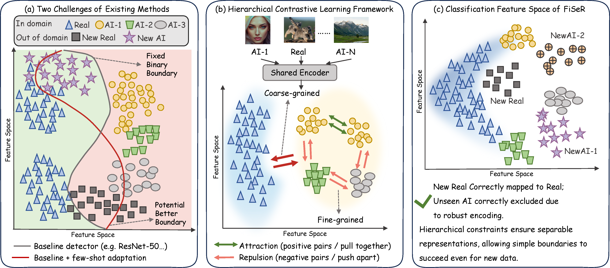

<div align="center">
  
</div>

<div align="center">
  <h1>FiSeR: Fine-Grained Source Representations for Cross-Domain AI Image Detection</h1>
  <p>
    <a href="https://arxiv.org/abs/2606.00606"></a>
    <a href="https://huggingface.co/heyongxin233/FiSeR-DINOv3-ViT-L16"></a>
  </p>
</div>

## Introduction

FiSeR learns transferable representations for AI-generated image detection
with two supervised contrastive objectives: a coarse natural/synthetic
objective and a fine-grained objective over synthetic source identities. The
released encoder is based on DINOv3 ViT-L/16 and supports GPU-FAISS kNN,
prototype, linear, and SVM heads.

This repository contains the FiSeR training and evaluation code, single-image
inference, and source snapshots with common launchers for 16 comparison
methods. Baseline weights, datasets, embeddings, and experiment outputs are not
included.

## Dataset

FiSeR is trained on WildFake and evaluated on WildFake, Community Forensics,
AIGIBench, Chameleon, and GenImage. Obtain each dataset from its official
release and follow its license. The expected LMDB format and split sizes are
documented in [DATASETS.md](DATASETS.md).

The repository provides adapters for all five datasets; no prepared LMDB or
image is redistributed. The full Community Forensics training release contains
4,783 source categories and can be processed directly from its parquet shards:

```bash
hf download OwensLab/CommunityForensics --repo-type dataset \
  --local-dir /path/to/CommunityForensics

python scripts/prepare_lmdb.py \
  --dataset community --root /path/to/CommunityForensics \
  --split train --output /path/to/community_train.lmdb \
  --expected-count 2971612 --expected-source-count 4783
```

See [DATASETS.md](DATASETS.md) for the required raw layouts and exact commands
for WildFake, Community Forensics, AIGIBench, Chameleon, and GenImage.

## Installation

Python 3.10+, CUDA, and a GPU-enabled FAISS build are required for formal
evaluation and kNN inference.

```bash
conda create -n fiser python=3.10 -y
conda activate fiser
pip install -r requirements.txt
pip install -e . --no-deps
```

Verify that FAISS sees at least one GPU:

```bash
python -c "import faiss; assert hasattr(faiss, 'GpuIndexFlatIP') and faiss.get_num_gpus() > 0"
```

DINOv3 requires `transformers>=4.56.1`. Depending on the current access policy,
the base model may also require `hf auth login`.

## Inference

Single-image inference runs the encoder and classification head on CUDA. Load a
local FiSeR checkpoint together with a trained linear head as follows:

```bash
CUDA_VISIBLE_DEVICES=0 python infer.py \
  --image /path/to/image.jpg \
  --model-name facebook/dinov3-vitl16-pretrain-lvd1689m \
  --checkpoint /path/to/fiser_checkpoint.pth \
  --head linear \
  --head-checkpoint /path/to/linear_head.pt \
  --layer 18 \
  --device cuda
```

For the published encoder and a GPU-FAISS kNN feature bank:

```bash
CUDA_VISIBLE_DEVICES=0 python infer.py \
  --image /path/to/image.jpg \
  --model-name heyongxin233/FiSeR-DINOv3-ViT-L16 \
  --head knn \
  --database-pt /path/to/wildfake_train_embeddings.pt \
  --layer 18 --k 25 --faiss-devices 0 --device cuda
```

A portable linear or prototype head can be built from an existing embedding
archive with `scripts/build_inference_head.py`. The inference command prints a
JSON prediction using the label convention `natural=0, synthetic=1`.

## Testing

First extract normalized hidden-state embeddings:

```bash
CUDA_VISIBLE_DEVICES=0 python extract_embeddings.py \
  --model-name heyongxin233/FiSeR-DINOv3-ViT-L16 \
  --dataset-lmdb /path/to/test_lmdb \
  --output /path/to/test_embeddings.pt \
  --layers 15 16 17 18 19 20 21 22 23
```

Then evaluate a training feature bank against a test archive. `evaluate.py`
rejects CPU-only FAISS installations.

```bash
CUDA_VISIBLE_DEVICES=0 python evaluate.py \
  --database-pt /path/to/wildfake_train_embeddings.pt \
  --test-pt /path/to/test_embeddings.pt \
  --head knn --layers 18 --max-k 25 --faiss-devices 0 \
  --output /path/to/metrics.json
```

Run the unit tests with:

```bash
pytest -q
```

## Training

Update `train_lmdb` in `configs/fiser_wildfake.yaml`, then launch distributed
training:

```bash
CUDA_VISIBLE_DEVICES=0,1 torchrun --nproc_per_node=2 \
  train.py --config configs/fiser_wildfake.yaml
```

The effective global batch size must be divisible by the distributed per-step
batch size. The training entrypoint saves standard Hugging Face checkpoints,
which can be loaded directly by the extraction and inference commands.

## Baselines

The baseline release is source-only: no trained baseline weights are
distributed. The `baselines/` directory contains common GPU launchers for all
16 comparison methods. The public training example defaults to five epochs;
change the environment variables as needed for your own experiment.

```bash
TRAIN_LMDB=/path/to/train.lmdb \
EPOCHS=5 \
OUTPUT_DIR=/path/to/output \
CUDA_VISIBLE_DEVICES=0 \
baselines/scripts/train.sh resnet50

LMDB_PATH=/path/to/test.lmdb \
MODEL_PATH=/path/to/your_checkpoint.pth \
CUDA_VISIBLE_DEVICES=0 \
baselines/scripts/evaluate.sh resnet50
```

Use the method ID in [baselines/README.md](baselines/README.md) to train and test
CNNDetection, LGrad, Gram-Net, FreqNet, NPR, SAFE, LASTED, UniFD, AIDE, DIRE,
Effort, SPAI, C2P-CLIP, or LOTA in the same way. The source snapshots under
`baselines/vendor/` retain their native dependencies and licenses; review
[THIRD_PARTY_NOTICES.md](THIRD_PARTY_NOTICES.md) before redistribution.

## Citation

```bibtex
@article{zhang2026fiser,
  title={FiSeR: Fine-Grained Source Representations for Cross-Domain AI Image Detection},
  author={Zhang, Shan and He, Yongxin and Zhang, Mingming and Tian, Huiwen and Ma, Lei},
  journal={arXiv preprint arXiv:2606.00606},
  year={2026}
}
```
